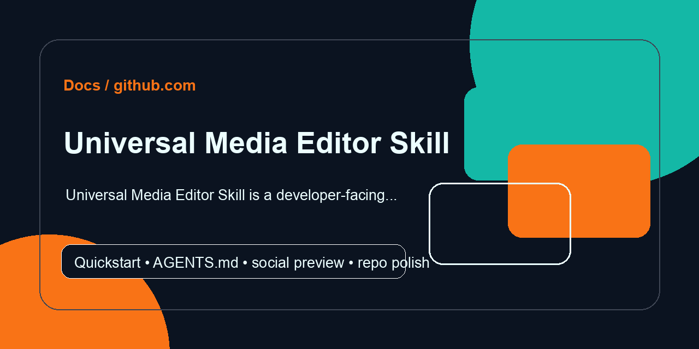

<!-- REPO-POLISH:START -->
<p align="center">
  
</p>

> Universal Media Editor Skill is a developer-facing project packaged for quick local understanding.

## Quick Start

```bash
git clone https://github.com/Supersynergy/universal-media-editor-skill
cd universal-media-editor-skill
git status --short
```

Expected result: the project runs locally or reports the next missing prerequisite directly in the terminal.

## Developer Map

| Need | Command |
|---|---|
| inspect | `git status --short` |

Full verification path: `git status --short`

Agent instructions live in [AGENTS.md](AGENTS.md).
<!-- REPO-POLISH:END -->

<div align="center">

```
                                                       ┌────────────────┐
                                                       │  $ media-edit  │
                                                       └────────────────┘

      ███▄ ▄███▓▓█████ ▓█████▄  ██▓ ▄▄▄        ▓█████ ▓█████▄  ██▓▄▄▄█████▓
     ▓██▒▀█▀ ██▒▓█   ▀ ▒██▀ ██▌▓██▒▒████▄      ▓█   ▀ ▒██▀ ██▌▓██▒▓  ██▒ ▓▒
     ▓██    ▓██░▒███   ░██   █▌▒██▒▒██  ▀█▄    ▒███   ░██   █▌▒██▒▒ ▓██░ ▒░
     ▒██    ▒██ ▒▓█  ▄ ░▓█▄   ▌░██░░██▄▄▄▄██   ▒▓█  ▄ ░▓█▄   ▌░██░░ ▓██▓ ░
     ▒██▒   ░██▒░▒████▒░▒████▓ ░██░ ▓█   ▓██▒  ░▒████▒░▒████▓ ░██░  ▒██▒ ░
     ░ ▒░   ░  ░░░ ▒░ ░ ▒▒▓  ▒ ░▓   ▒▒   ▓▒█░  ░░ ▒░ ░ ▒▒▓  ▒ ░▓    ▒ ░░
     ░  ░      ░ ░ ░  ░ ░ ▒  ▒  ▒ ░  ▒   ▒▒ ░   ░ ░  ░ ░ ▒  ▒  ▒ ░    ░
     ░      ░      ░    ░ ░  ░  ▒ ░  ░   ▒        ░    ░ ░  ░  ▒ ░  ░
            ░      ░  ░   ░     ░        ░  ░     ░  ░   ░     ░
                        ░                               ░

              universal media editor — cut · caption · polish
```

# `media-edit`

### **Polish any video or audio on your Mac. One command.**

**Cut silences. Transcribe. Burn captions. Denoise. Master to broadcast loudness. Separate stems. Detect scenes. Resync subtitles.** All in one adaptive CLI — Metal-accelerated where it matters, 100% local, zero cloud.

```bash
media-edit polish raw_podcast.mp4
# ✂️  silence cut → 🔇 denoise → 🎚 -16 LUFS → 📝 transcribe → 🎨 burn captions
```

[](https://www.apple.com/macos/)
[](#-how-it-adapts)
[](LICENSE)
[](https://github.com/Supersynergy/universal-media-editor-skill/actions/workflows/shellcheck.yml)
[](CONTRIBUTING.md)

</div>

---

## ⚡ 60 seconds

```bash
media-edit polish lecture.mov              # full pipeline, done.
media-edit cut interview.mp4               # just remove silences
media-edit transcribe talk.mp4 srt         # whisper.cpp Metal → talk.srt
media-edit caption reel.mp4 out.mp4 tiktok # burn yellow outlined captions
media-edit master song.wav "" -14          # master to Spotify -14 LUFS
media-edit stems song.mp3                  # split vocals/drums/bass/other
media-edit scenes movie.mkv 27             # auto-split by scene cuts
media-edit pitch voice.wav 2 1.0           # +2 semitones, keep tempo
media-edit syncsub movie.mkv subs.srt      # fix subtitle drift (alass)
```

That's the whole API. Each primitive routes to the best-in-class local tool. `polish` chains the important ones.

---

## 📦 Install

```bash
/bin/bash -c "$(curl -fsSL https://raw.githubusercontent.com/Supersynergy/universal-media-editor-skill/main/install.sh)"
```

Read [install.sh](install.sh) first — it's ~70 lines. Uninstall any time with the matching `uninstall.sh`.

**What gets installed:**

- **Brew**: `ffmpeg` `whisper-cpp` `rubberband` `sox` `alass` `mediainfo` `mpv`
- **uv tools**: `auto-editor` `demucs` `scenedetect` `ffmpeg-normalize`
- **The shell**: `media-edit.sh` sourced into your `~/.zshrc`
- **Skill file**: dropped into `~/.gg/skills/` if it exists (optional — for Claude Code / GG Coder / AI agents)

---

## 🎯 What each command owns

| Command            | Tool underneath             | Why it's the right pick                                         |
|--------------------|-----------------------------|------------------------------------------------------------------|
| `cut`              | `auto-editor`               | Speech-aware, beats `ffmpeg silenceremove` by miles              |
| `trim`             | `ffmpeg -c copy`            | Zero re-encode, frame-accurate on keyframes                      |
| `concat`           | `ffmpeg -f concat -c copy`  | Lossless join for compatible streams                             |
| `transcribe`       | `whisper.cpp` (Metal)       | 8–16× faster than CPU on Apple Silicon, no cloud                 |
| `caption`          | `whisper.cpp` + `ffmpeg ASS`| Generates then burns styled subs in one call                     |
| `denoise`          | `ffmpeg anlmdn`             | Non-local-means, best built-in denoiser                          |
| `master`           | `ffmpeg-normalize`          | Proper 2-pass EBU R128, broadcast-compliant                      |
| `stems`            | `demucs htdemucs`           | SOTA local source separation                                     |
| `scenes`           | `PySceneDetect`             | Content-aware, frame-accurate splits                             |
| `pitch`            | `rubberband`                | SOTA independent pitch/tempo                                     |
| `syncsub`          | `alass`                     | Magical re-sync without needing a transcript                     |

---

## ✨ `polish` — the killer feature

```bash
media-edit polish raw.mp4 polished.mp4 modern
```

Runs 5 steps, each with the right tool:

```
 [1/5] ✂️   auto-editor silence-cut
 [2/5] 🔇  ffmpeg highpass + anlmdn + lowpass
 [3/5] 🎚   ffmpeg-normalize → -16 LUFS (YouTube)
 [4/5] 📝  whisper.cpp Metal → SRT
 [5/5] 🎨  ffmpeg ASS burn-in (modern | tiktok | cinema styles)
```

Result: a captioned, denoised, loudness-correct, silence-trimmed video in one command. Drop it into a `recipe` file and share your workflow.

---

## 📋 Recipes

Pipelines as plain text. Ship one per use-case:

```bash
# recipes/podcast.recipe
cut                 # silence removal
denoise             # anlmdn
master -16          # YouTube loudness
transcribe srt
caption modern
```

```bash
media-edit recipe recipes/podcast.recipe my_show.mp4
```

Bundled recipes: **podcast** (-16 LUFS, modern captions), **tiktok** (-14 LUFS, yellow big text), **cinema** (-23 LUFS, subtle serif captions).

---

## 🧠 How it adapts

`me_info` detects your Mac on first use:

| Tier | Chip | Whisper default | Encoder |
|------|------|-----------------|---------|
| 🏆 Ultra | M*-Ultra | `large-v3` | `hevc_videotoolbox` |
| ⚡ Max | M*-Max | `large-v3` (≥32 GB) | `hevc_videotoolbox` |
| 💪 Pro | M*-Pro | `medium.en` | `hevc_videotoolbox` |
| 🍎 Base | M1/M2/M3/M4 | `base.en` | `hevc_videotoolbox` |
| 🖥 Intel | Intel Mac | `tiny.en` or `base.en` | `libx264` |

Override anytime: `ME_WHISPER_MODEL=large-v3 media-edit transcribe …`

---

## 🆚 Sister skill

Need *format conversion* (MP4↔MKV, WAV↔MP3, PNG↔AVIF)? Use **[`conv`](https://github.com/Supersynergy/universal-file-media-converter-skill)** — the sibling skill. They're designed to chain:

```bash
conv raw.mov working.mp4           # normalize container
media-edit polish working.mp4      # polish it
conv polished.mp4 final.webm       # re-encode for distribution
```

---

## 🥚 Easter eggs

```bash
media-edit joke      # encoding joke
media-edit zen       # editing koan
media-edit stats     # lifetime ops counter + most-used commands
```

Plus a daily whisper.cpp model download notification, optional completion chime (`ME_SOUND=0` to silence), and — you'll find the rest.

---

## 🤖 AI agent integration

Drops `skill/universal-media-editor.md` into `~/.gg/skills/` on install. Claude Code, GG Coder, and similar agents will route *editing* requests through `media-edit` and *conversion* requests through `conv`. Natural split.

---

## ⚠️ Honest limits

- **macOS only.** The adaptive profile and Metal paths are Apple-specific.
- **`polish` is opinionated.** It assumes spoken content. For music mastering, use `master` + `stems` directly.
- **Whisper models download on first transcribe** (~150 MB for base.en, ~3 GB for large-v3). Cached to `~/.cache/whisper.cpp/`.
- **Subtitle timing** from Whisper is segment-level. For word-level karaoke timing, run `faster-whisper` with `--word_timestamps`.

---

## 🤝 Contributing

See [CONTRIBUTING.md](CONTRIBUTING.md). Most-wanted: **new recipes** for your workflow, **M1/M2/Ultra benchmarks**, **additional primitives**.

## 📜 License

MIT — by [Maxim Supersynergy](https://github.com/Supersynergy).

---

<div align="center">

*If this saved you an hour of editing, star it ⭐ and tell a friend who still does it by hand.*

</div>
